# SQL Data Warehouse Project

## Overview

This project is a hands-on implementation of a modern **SQL data warehouse** built with **SQL Server**.

The main goal is to practice the end-to-end data engineering workflow, including data ingestion, data cleaning, transformation, integration, and dimensional data modeling.

The warehouse consolidates data from two source systems — **ERP** and **CRM** — and transforms the raw data into a structured, analysis-ready data model.

> **Project Status:** Data warehouse implementation only.  
> Data analysis and reporting are currently outside the scope of this project.

---

## Architecture

The project follows the **Medallion Architecture**, consisting of three layers:

### Bronze Layer — Raw Data

The Bronze layer stores the source data in its original form.

- Imports raw CSV files from ERP and CRM systems
- Preserves the original source data
- Acts as the initial landing layer of the data warehouse

### Silver Layer — Cleaned & Integrated Data

The Silver layer transforms the raw data into consistent and reliable datasets.

Key transformations include:

- Data cleansing
- Handling missing or invalid values
- Standardising formats
- Data type conversion
- Removing duplicate records
- Normalising values
- Integrating data from different source systems

### Gold Layer — Business-Ready Data

The Gold layer contains structured datasets designed for analytical use.

The data is modelled using a **Star Schema**, consisting of:

- Fact tables
- Dimension tables
- Surrogate keys
- Relationships between business entities

This layer provides a simplified and consistent representation of the underlying ERP and CRM data.

---

## ETL Workflow

The overall data pipeline follows the process:

```text
ERP / CRM CSV Files
        ↓
     Bronze
   Raw ingestion
        ↓
     Silver
Cleaning & Transformation
        ↓
      Gold
 Dimensional Modeling
```

The ETL process is implemented using SQL scripts and stored procedures in SQL Server.

---

## Data Sources

The project uses CSV datasets originating from two source systems:

- **CRM** — customer and sales-related data
- **ERP** — product, customer, and operational data

The datasets are integrated during the Silver and Gold stages to create a unified data warehouse.

---

## Data Modeling

The Gold layer uses **dimensional modeling** to organise the data into a star schema.

The model separates descriptive business entities into **dimension tables** and measurable business events into **fact tables**.

This design makes the warehouse easier to understand and prepares the data for future analytical queries and reporting.

---

## Repository Structure

```text
data-warehouse-project/
│
├── datasets/
│   ├── source_crm/
│   └── source_erp/
│
├── docs/
│   ├── data_architecture.drawio
│   ├── data_flow.drawio
│   ├── data_models.drawio
│   └── data_catalog.md
│
├── scripts/
│   ├── bronze/
│   ├── silver/
│   └── gold/
│
├── tests/
│
└── README.md
```

### `datasets/`

Contains the source CSV files used to populate the warehouse.

### `scripts/bronze/`

SQL scripts responsible for creating and loading the Bronze layer.

### `scripts/silver/`

SQL scripts responsible for cleaning, standardising, and transforming the raw data.

### `scripts/gold/`

SQL scripts responsible for creating the dimensional model and Gold-layer views or tables.

### `tests/`

Contains SQL-based data quality and validation checks.

### `docs/`

Contains documentation for the architecture, data flow, data model, and data catalog.

---

## Technologies

- **SQL Server**
- **SQL Server Management Studio (SSMS)**
- **Draw.io**
- **Git & GitHub**
- **CSV**

---

## Acknowledgement

This project was developed as a learning project while following the **SQL Data Warehouse Project by Data With Baraa**.
